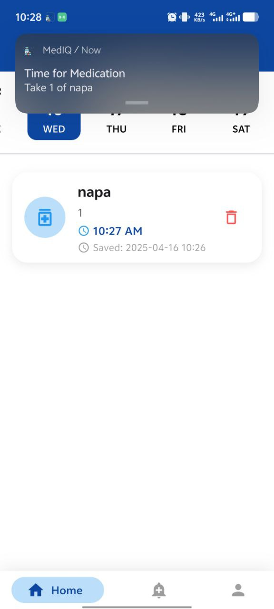
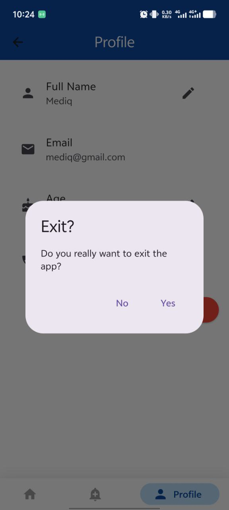
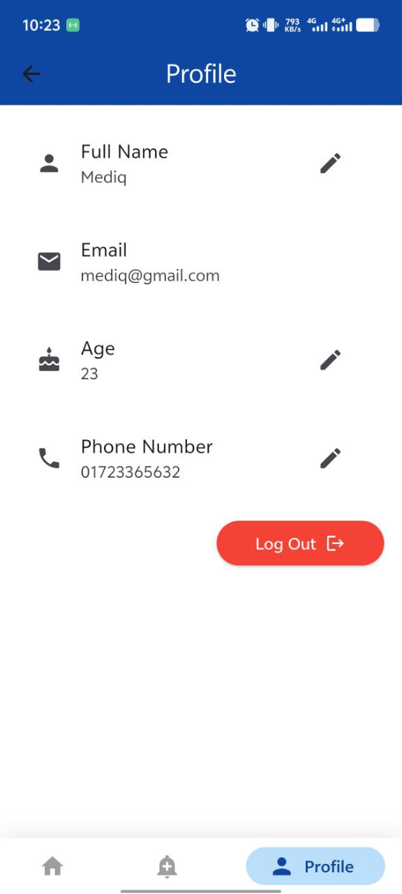
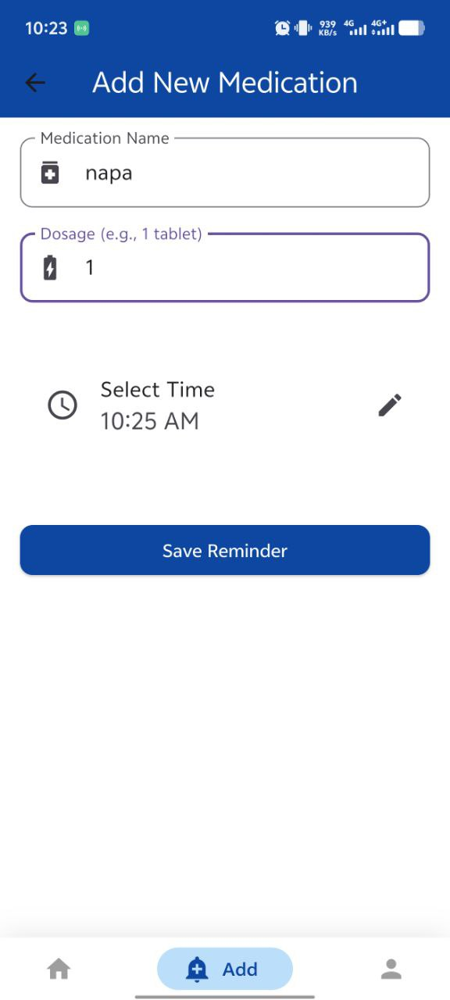
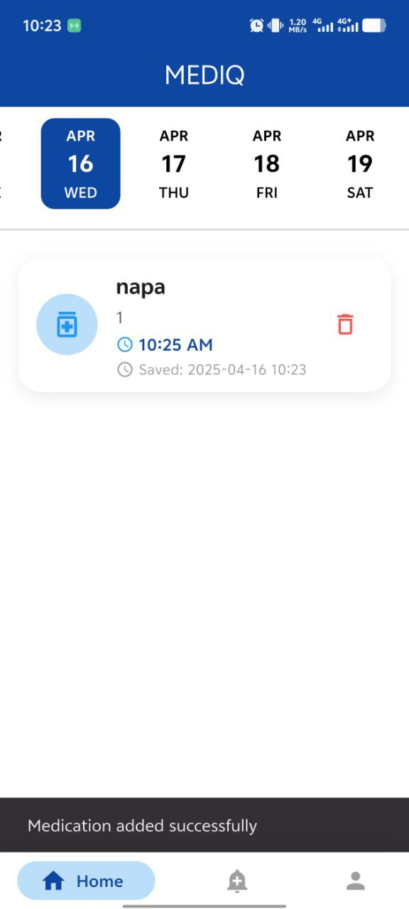
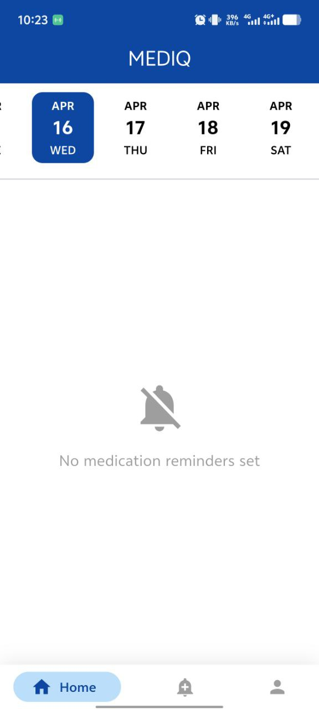
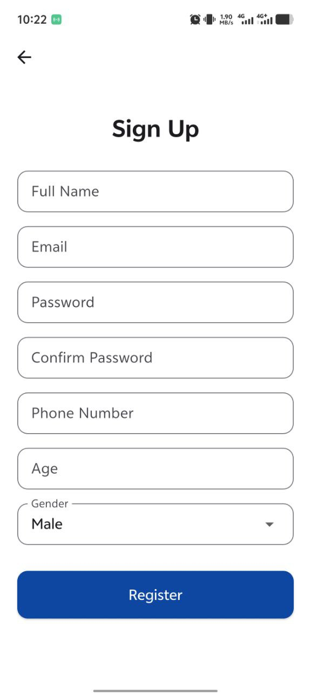
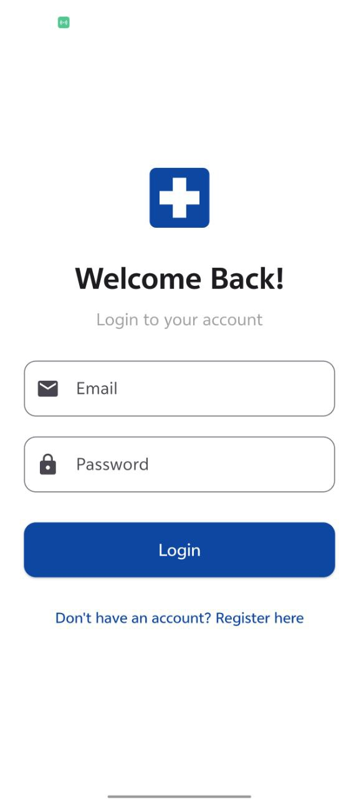
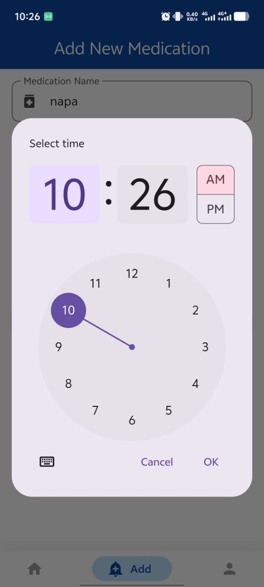

## MedIQ – Medicine Reminder App

## Description
MedIQ is a powerful and easy-to-use Flutter application designed to help users manage their medication schedules efficiently. With Firebase authentication and local database support via sqflite, MedIQ ensures your data is secure, synchronized, and accessible — even offline. Never miss a dose again!

## Features
🔐 User Authentication
Secure sign up and login using Firebase Authentication.

🗓️ Custom Date Timeline
Intuitive and interactive date timeline to view and manage medications day-by-day.

💊 Medicine Reminders
Get notified when it’s time to take your medicine using local notifications.

🧠 Smart Scheduling
Add, update, or remove medications with customizable timing and repeat options.

🗃️ Offline Support
Local database (sqflite) ensures the app functions even without an internet connection.

🌐 Cloud Sync
User-specific data is synced with Firebase to ensure access from any device.

🛠️ Tech Stack
Flutter – Cross-platform mobile framework

Firebase Auth – User authentication

Firebase Firestore – Cloud data storage

Sqflite – Local SQLite database

Flutter Local Notifications – Scheduled medication alerts

## Project ScreenShot

        

## App Demo Video
https://drive.google.com/file/d/1UlfKA4xVyHWujtVPhhyhwKForX1hffa8/view?usp=drive_link

## Project Report
